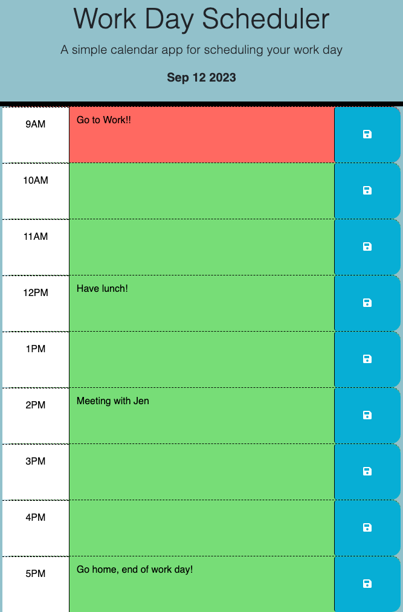

# Work Day Scheduler Starter Code

## Description

This web browser is a work day scheduler. It is a daily schedule that allows you to input multiple tasks throughout the workday and save it for later viewing. The work day scheduler also allows users to track the hours throughout the day. This webpage is a refactored started code, please view contributors in github for credits.

https://keiras1.github.io/work-day-schedule/

## Usage

The usage for this application is very user friendly. It gives the current day, and displays the usual 9 - 5 work day hour-by-hour, schedule. The user can input tasks that correspond to the different hours throughout the day and that information will be saved in the browser so the user can come back and check it later. Note that in order to save the information, the user must click onto the save button on the right side of the screen on the corresponding hour for the information to be stored. The application is very helpful for time-of-day tracking as well. It displays red for the current hour, green for hours ahead and grey for previous hours, this is a very helpful tool in keeping track of daily productivity.

## Credit

Please view contributors of the refactored starter code.

